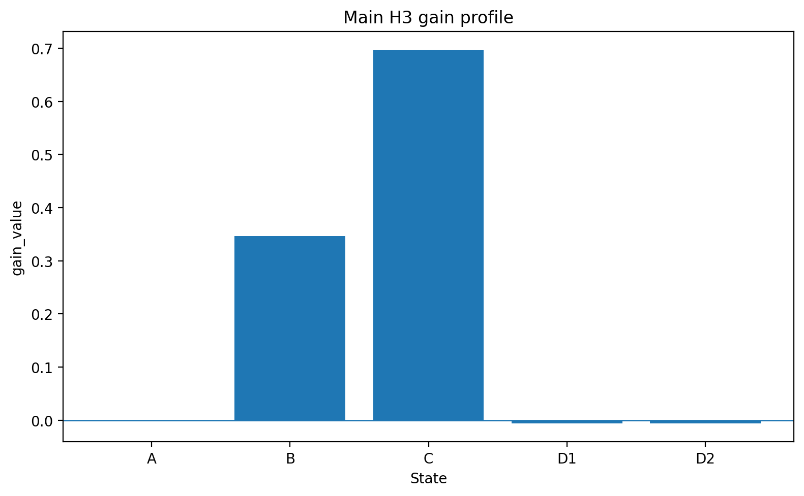

# Quantum–Spacetime Bridge

*A wave-based research program exploring whether bounded local relational structure can serve as a testable bridge between quantum behavior and spacetime-like organization.*

---

## Why this project exists

The motivation behind this project is simple but ambitious.

If matter is fundamentally wave-like, then it is natural to ask whether traces of spacetime-like organization might already become visible at the level of local interference, relational structure, and correlation patterns. This does **not** mean that spacetime has already been derived, nor that a complete unification has been achieved. But it does justify a careful search for bounded, testable intermediate structures.

This repository exists as a public scientific entry point for that search.

Its purpose is to make the current theoretical direction, methodological discipline, visual intuition, and intermediate results visible in a readable form, without forcing readers to begin in low-level technical code.

---

## Core idea

The core idea is not to begin with a grand claim, but with a constrained question:

> Can a physically motivated local signal remain readable when the model becomes more explicit, the representation more granular, and the null-model pressure stronger?

The present approach is therefore deliberately stepwise:

- begin with a wave-based physical intuition,
- translate that intuition into an operational model,
- work with pair-based local structure rather than overly coarse aggregation,
- freeze logic before claiming robustness,
- and test every nontrivial signal against explicit null-model and sensitivity checks.

In this sense, the project is closer to a bounded methodological research program than to a completed theory.

---

## Current status

At the current stage, the following elements are already in place:

- a pair-based representation for local support-side structure,
- a fixed-logic H3 test block,
- a mixed-like sensitivity test,
- an explicit D1/D2 null-model divergence test,
- and an openly documented intermediate result status.

### Current result status

The present outcome is best described as:

**bounded methodological evidence, not a full theory claim**

More concretely:

- a small local support-side signal remains readable under baseline-first conditions,
- the signal scales monotonically under controlled manipulation,
- the signal survives mixed-pair remapping,
- and the two main null models do not practically collapse into one another.


## Visual overview

### Concept image


*Conceptual illustration of the motivating bridge idea: an upper quantum domain, a correlation-bearing connector, and a lower spacetime-like domain. This figure is heuristic and not a direct numerical output.*

### Main result profile



*Compact view of the current local support-side H3 result: ordered A/B/C behavior under controlled manipulation, with low null-model levels for D1 and D2.*


## What is already supported

The current workflow supports the following claims at an intermediate methodological level:

- a readable local support-side signal exists in the present pair-based H3 setup,
- the A/B/C structure shows ordered monotone behavior,
- the result remains stable across mixed-like remapping modes,
- D1 and D2 are distinct null-model constructions,
- the observed effect sits in weighted relational structure, not in topological connectivity or derived distance geometry.

These are meaningful results, but they are intentionally kept within a bounded interpretation.

---

## What is not claimed

This repository does **not** claim:

- a full derivation of spacetime from quantum theory,
- a completed bridge mechanism,
- a final proof of a hierarchy,
- a finished unified theory of quantum theory and relativity,
- or that the present local result should already be treated as a complete physical explanation.

This boundary is important.

The project is deliberately structured so that local methodological validity comes first, and broader interpretation only follows if intermediate steps remain stable under explicit scrutiny.

---

## Repository structure

This repository is intended to function as a readable public entry point rather than as a raw technical dump.

A recommended structure is:

```text
README.md
docs/
figures/
notes/
results/
links/
```

### Suggested meaning of the folders

- **docs/**  
  Short research notes, public-facing summaries, and intermediate theory texts.

- **figures/**  
  Conceptual illustrations, result plots, workflow diagrams, and selected table graphics.

- **notes/**  
  Methodological notes, fixed-logic protocols, robustness summaries, and block-level readouts.

- **results/**  
  Selected high-level outputs and compact summaries, not necessarily the full technical archive.

- **links/**  
  References to supporting material, external documents, and technical subrepositories.

---

## Reproducibility

One goal of this project is that readers should not have to trust claims blindly.

Where possible, the following are made visible:

- code repositories,
- intermediate methodological notes,
- selected plots,
- summary tables,
- and public-facing research notes.

This repository is therefore meant as a readable public front-end, while some lower-level technical work remains distributed across specialized code repositories.

---

## AI usage note

AI tools were used in a supporting role for language polishing, structural drafting, and the preparation of some conceptual visual material.

The scientific framing, methodological decisions, interpretation of results, and project claims remain the responsibility of the author.

Conceptual images in this repository are heuristic illustrations and should not be read as direct outputs of the numerical model unless explicitly stated otherwise.

---

## Technical subrepositories

This repository is intended to serve as a theory-facing public entry point, not as the only technical location of the project.

Some lower-level code, numerical workflows, and supporting material currently remain distributed across specialized subrepositories. In particular:

- **polyakov-gram-graph**  
  Matrix-, graph-, and relation-based structural backbone of the broader workflow.

- **debroglie-phase-verification**  
  Verification-oriented and numerically structured project environment for intermediate bridge-related tests.

These repositories should be understood as part of the technical machinery behind the broader research direction.

A useful way to read the project structure is therefore:

**Quantum–Spacetime Bridge** → readable public theory-facing entry point  
**Technical subrepositories** → specialized numerical and structural backbone

---

## Author

**Ralf Kemmann**  
Independent Researcher  
ORCID iD: **0009-0008-9932-3745**

---

## Citation and contact

If you reference this project, please cite the repository title and the author clearly. A more formal citation format can be added once the repository structure stabilizes.

Suggested project citation form:

**Ralf Kemmann, *Quantum–Spacetime Bridge*, GitHub repository, ongoing research project.**

A formal citation file (`CITATION.cff`) can be added later.

---

## Final note

This project should be read as an open-ended scientific bridge attempt in a careful sense:

not as a proclamation that the bridge is complete,  
but as a structured effort to test whether local, wave-based, relational signals can survive increasingly explicit methodological pressure.

That is the present scientific meaning of the work.
