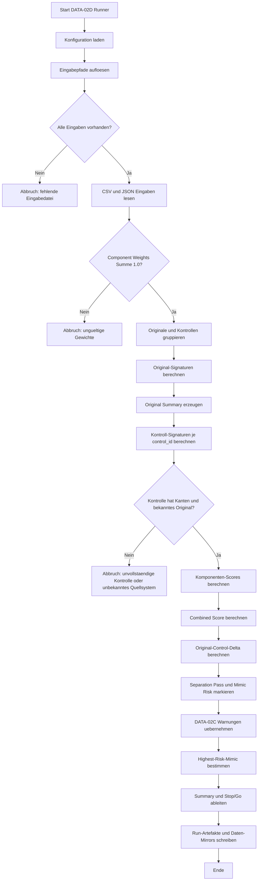

# QSB-BRIDGE-DATA-02D Programmablaufplan

## 1. Purpose

Dieser Programmablaufplan beschreibt den Ablauf des bestehenden Runners:

```text
scripts/qsb_bridge_data02d_diagnostic_separation.py
```

Der Runner berechnet eine synthetische/reference-style Diagnostic Separation fuer DATA-02D. Er vergleicht die DATA-02B Original-Scaffolds mit den DATA-02C Kontroll-Ensembles anhand transparenter Scaffold-Diagnostiken.

Der Ablauf ist methodisch und scaffold-bezogen. Er nutzt keine Koordinaten, keine geometrieabgeleiteten K_ij-Werte und keine externen Daten.

## 2. Input Files

Der Runner liest die Konfiguration:

```text
data/QSB-BRIDGE-DATA-02D/diagnostic_separation_config.json
```

Aus dieser Konfiguration werden lokale Eingaben geladen:

```text
data/QSB-BRIDGE-DATA-02B/carbon_ladder_nodes.csv
data/QSB-BRIDGE-DATA-02B/carbon_ladder_edges.csv
data/QSB-BRIDGE-DATA-02B/carbon_bonding_organization_manifest.json
data/QSB-BRIDGE-DATA-02C/control_nodes.csv
data/QSB-BRIDGE-DATA-02C/control_edges.csv
data/QSB-BRIDGE-DATA-02C/control_ensemble_manifest.json
runs/QSB-BRIDGE-DATA-02C/control_ensembles_open/organization_coherence_summary.csv
```

Diese Eingaben sind synthetische/reference-style Scaffold- und Kontrollartefakte.

## 3. Output Files

Der Runner schreibt Run-Artefakte nach:

```text
runs/QSB-BRIDGE-DATA-02D/diagnostic_separation_open/
```

Run-Ausgaben:

```text
summary.json
readout.md
original_diagnostic_summary.csv
control_diagnostic_summary.csv
original_vs_control_separation.csv
highest_risk_mimic_diagnostic.csv
diagnostic_component_weights.csv
proxy_risk_summary.csv
resolved_config.json
```

Zusaetzlich schreibt der Runner Daten-Mirrors nach:

```text
data/QSB-BRIDGE-DATA-02D/diagnostic_manifest.json
data/QSB-BRIDGE-DATA-02D/original_diagnostic_summary.csv
data/QSB-BRIDGE-DATA-02D/control_diagnostic_summary.csv
data/QSB-BRIDGE-DATA-02D/original_vs_control_separation.csv
data/QSB-BRIDGE-DATA-02D/highest_risk_mimic_diagnostic.csv
data/QSB-BRIDGE-DATA-02D/diagnostic_component_weights.csv
```

Dieser Programmablaufplan selbst fuehrt den Runner nicht aus und erzeugt keine neuen Daten- oder Run-Artefakte.

## 4. Step-by-step Ablauf

1. Projektwurzel und Konfigurationspfad bestimmen.

   Der Runner setzt `ROOT` relativ zur Script-Datei und erwartet die DATA-02D Konfiguration unter `data/QSB-BRIDGE-DATA-02D/diagnostic_separation_config.json`.

2. Konfiguration laden.

   Aus der Konfiguration werden Block-ID, Run-ID, Eingabepfade, Ausgabepfade, Component Weights, Separation Threshold, Mimic Threshold und Warntexte gelesen.

3. Eingabepfade aufloesen.

   Relative Pfade werden gegen die Projektwurzel aufgeloest. Absolute Pfade bleiben unveraendert.

4. Eingaben auf Existenz pruefen.

   Jeder konfigurierte Eingabepfad muss existieren. Fehlende Eingaben fuehren zum Abbruch.

5. CSV- und JSON-Eingaben laden.

   Der Runner liest Original-Knoten, Original-Kanten, Kontroll-Knoten, Kontroll-Kanten, DATA-02B Manifest, DATA-02C Manifest und die DATA-02C Organization-Coherence-Zusammenfassung.

6. Component Weights pruefen.

   Die Gewichte der diagnostischen Komponenten muessen in Summe 1.0 ergeben. Andernfalls bricht der Runner ab.

7. Ausgabeordner vorbereiten.

   Der Runner legt die konfigurierten DATA-02D Daten- und Run-Verzeichnisse an, falls sie fehlen.

8. Originale und Kontrollen gruppieren.

   Original-Knoten und -Kanten werden nach `system_id` gruppiert. Kontroll-Knoten und -Kanten werden nach `control_id` gruppiert.

9. Original-Signaturen berechnen.

   Fuer jedes Originalsystem wird eine Scaffold-Signatur berechnet:

   - node_count
   - edge_count
   - degree_distribution
   - topology_class_counts
   - bond_order_counts
   - hybridization_counts
   - node_pi_counts
   - node_sigma_counts
   - edge_pi_counts
   - edge_sigma_counts
   - edge_set
   - local_environment_counts

10. Original-Zusammenfassung erzeugen.

   Originale werden als Selbstreferenz mit Komponentenwerten 1.0 berichtet. Der Combined Score ist dabei ein Scaffold-Referenzscore.

11. Kontroll-Signaturen berechnen.

   Fuer jede Kontrolle wird die Signatur gegen das jeweilige Quell-Original berechnet. Dabei werden die Original-Endpunkte der Kontrolle bevorzugt, wenn sie in den Kontrollkanten vorhanden sind.

12. Komponenten-Scores berechnen.

   Der Runner berechnet:

   - topology_signature_diagnostic
   - degree_distribution_diagnostic
   - bond_order_distribution_diagnostic
   - hybridization_distribution_diagnostic
   - sigma_pi_organization_diagnostic
   - local_environment_consistency_diagnostic

13. Combined Score berechnen.

   Die Komponenten werden mit den konfigurierten Gewichten zu `combined_bonding_organization_score` zusammengefuehrt. Dieser Score bleibt ein synthetischer Scaffold-Score.

14. Original-Control-Delta berechnen.

   Pro Original/Kontrolle-Paar wird `original_control_delta = original_combined_score - control_combined_score` berechnet.

15. Separation und Mimic Risk markieren.

   Der Runner setzt:

   - `separation_pass_flag`, wenn das Delta mindestens den konfigurierten Separation Threshold erreicht.
   - `mimic_risk_flag`, wenn das Delta unter oder gleich dem Mimic Threshold liegt oder wenn die Kontrolle aus DATA-02C als expliziter Risiko-/Low-Contrast-Fall mitgefuehrt wird.

16. DATA-02C Warnungen uebernehmen.

   Der Runner traegt DATA-02C Warnungen fuer negative Findings, Highest-Risk-Mimics und Lowest-Contrast-Faelle in `control_warning_carried_from_DATA02C` ein.

17. Highest-Risk-Mimic-Ausgabe bestimmen.

   Der Runner waehlt die niedrigsten Delta-Faelle und die explizit aus DATA-02C mitgefuehrten Risikokontrollen fuer `highest_risk_mimic_diagnostic.csv`.

18. Component- und Proxy-Risiko-Tabellen erzeugen.

   Die Komponentengewichte und Proxy-Risiken werden mit Signalquelle, Risiko-Boundary und Warnungen dokumentiert.

19. Summary und Stop/Go ableiten.

   Wenn fehlgeschlagene Separations oder Mimic-Risk-Faelle vorhanden sind, setzt der Runner `stop_go_outcome` auf `revise_diagnostics_due_to_control_mimicry`. Andernfalls waere der methodische Ausgang `go_diagnostic_separation_with_documented_boundaries`.

20. JSON, CSV und Readout schreiben.

   Der Runner schreibt die Run-Artefakte, die Daten-Mirrors, das resolved config JSON und das human-readable `readout.md`.

## 5. Mermaid Flowchart



## 6. Failure/Stop Conditions

Technische Abbruchbedingungen im Runner:

- Eine konfigurierte Eingabedatei fehlt.
- Die Summe der Component Weights ist nicht 1.0.
- Eine Kontrolle besitzt Knoten, aber keine passende Kanten-Gruppe.
- Eine Kontrolle verweist auf ein unbekanntes Source-System.

Methodische Stop-/Boundary-Bedingungen:

- `original_control_delta` liegt unter dem Separation Threshold.
- `original_control_delta` liegt bei null oder sehr niedrig.
- Eine Kontrolle ist aus DATA-02C als Highest-Risk- oder Low-Contrast-Fall mitgefuehrt.
- Fehlgeschlagene Separations oder Mimic-Risk-Faelle setzen den Stop/Go-Ausgang auf `revise_diagnostics_due_to_control_mimicry`.

Diese Bedingungen sind keine Stoerfaelle, sondern Teil der synthetischen Diagnostic Separation. Low Contrast und Mimicry markieren die Grenze des aktuellen Scanners.

## 7. Claim Boundary

DATA-02D bleibt synthetisch/reference-style und scaffold-bezogen.

DATA-02D bietet keine:

- real-data validation
- molecular validation
- physical validation
- spacetime emergence
- physical metric recovery
- causal structure
- de-Broglie confirmation
- real quantum dynamics
- proof that electronic configurations are recognized
- proof that bonding organization is physically recognized

Der `combined_bonding_organization_score` ist ein synthetischer Scaffold-Score. Er ist kein physikalischer oder molekularer Erkennungsscore.

Die mitgefuehrte QSB-BRIDGE-NUM-05C Warnung bleibt relevant:

```text
local-neighborhood sensitivity under small additive magnitude noise at 0.02
```

Die mitgefuehrte DATA-02C Mimic-Warnung bleibt relevant:

```text
some controls show zero/low original-control contrast, especially within-system label shuffles for small/uniform systems
```
