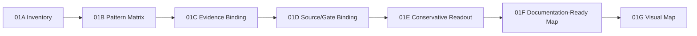
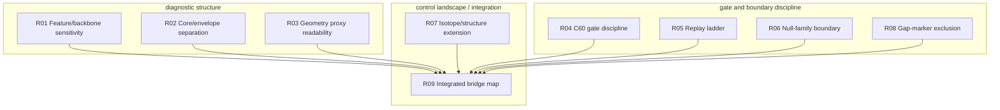
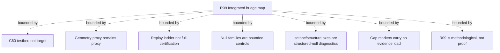

# QSB-BRIDGE-SYNTH-01G Visual Documentation Map

## 1. Purpose

QSB-BRIDGE-SYNTH-01G creates a visual documentation map for the QSB-BRIDGE-SYNTH-01A to 01F sequence.

The map makes the synthesis ladder, the nine documentation readouts, and the claim-boundary guardrails visible in a form suitable for internal method notes, masterchat integration, or cautious documentation.

This block adds no numerics, no tests, and no physical claim.

## 2. Input basis

Primary inputs:

```text
data/qsb_bridge_synth_01f_documentation_synthesis_map.csv
docs/QSB_BRIDGE_SYNTH_01F_DOCUMENTATION_READY_SYNTHESIS_MAP.md
docs/QSB_BRIDGE_SYNTH_01F_RESULT_NOTE.md
```

01G translates the 01F documentation-ready synthesis map into:

```text
a ladder diagram
a grouped readout diagram
a guardrail diagram
node and edge CSV tables
```

## 3. The synthesis ladder

The synthesis ladder is documentation flow, not a proof chain.

Each stage adds a stricter documentation layer:

```text
01A inventories.
01B groups.
01C binds evidence roles.
01D binds source columns, gates, ladders, and gaps.
01E states conservative readouts.
01F makes the map documentation-ready.
01G visualizes the map.
```

## 4. Visual map: ladder view



## 5. Visual map: readout structure



## 6. Visual map: claim-boundary guardrails



## 7. Interpretation

The visual map supports a conservative documentation reading:

```text
QSB-BRIDGE-SYNTH-01A to 01G form a method map.
The map shows recurring diagnostic, gate, proxy, control, boundary, and gap-register structures.
These structures may be described as methodically visible properties of a possible correlation-bridge workstream.
They are not physical proof.
```

The readout structure deliberately separates:

```text
diagnostic structure
gate and boundary discipline
control landscape / integration
```

This prevents R09 from becoming an unbounded umbrella claim.

## 8. Claim Boundary

01G proves no QSB thesis.

It does not prove:

```text
physical emergence
spacetime emergence
global non-genericity
metric reconstruction
causal structure
complete raw-order replay certification
direct de-Broglie confirmation
```

Protected boundaries:

```text
C60 is testbed, not target.
near_distance=0 is not identity or isomorphism.
role_transport_allowed follows only from explicit mapping/isomorphism gates.
Stage3A DRY_RUN_READY is not full replay.
G5G2 per-index photo agreement is not full raw-order certification.
Geometry Proxy remains proxy.
Core/Envelope-Containment remains graph behavior.
Isotope/structure axes remain structured-null diagnostics.
Gap-only markers carry no evidential load.
R09 integrated bridge map is methodological, not physical proof.
```

## 9. Next Step / Pause Anchor

QSB-BRIDGE-SYNTH-01A to 01G now provide a methodically defensive bridge map.

The next later step should not be a stronger thesis by default. It should be one of:

```text
Masterchat integration
public cautious background with claim boundaries
targeted source-binding of open gap markers
```

Pause anchor:

```text
QSB-BRIDGE-SYNTH-01A bis 01G liefern eine methodisch defensive Brueckenkarte.
Der naechste spaetere Schritt sollte keine staerkere These sein, sondern
entweder Masterchat-Integration, oeffentliche Kurzfassung mit Claim Boundaries
oder gezielte Nachbindung offener Gap-Marker.
```
