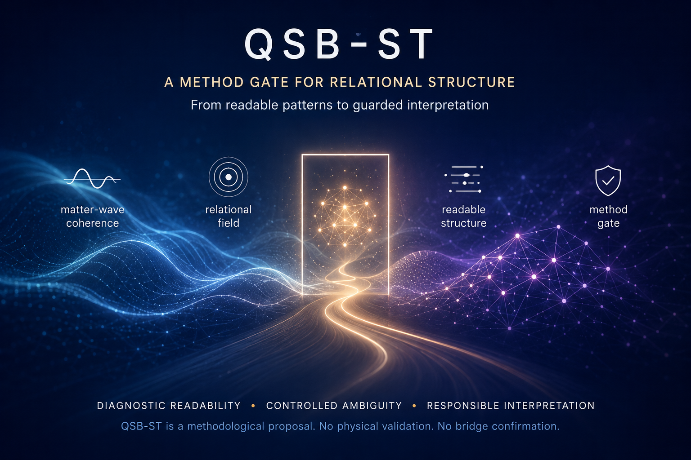
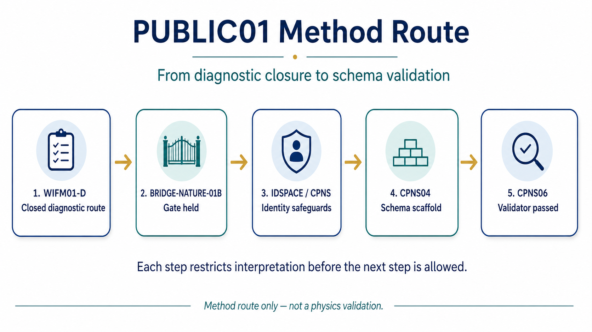
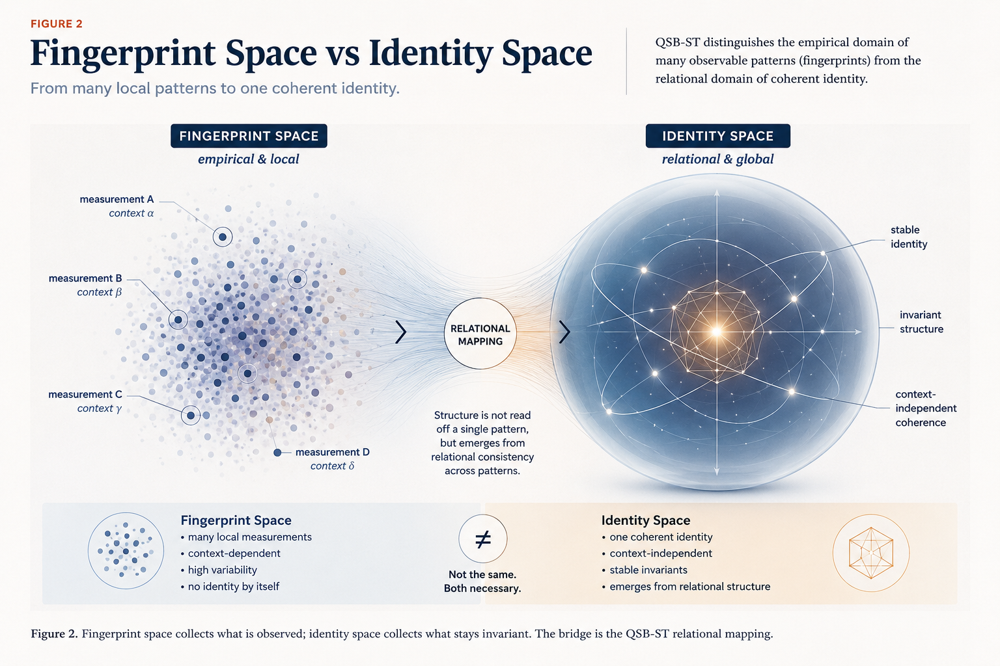
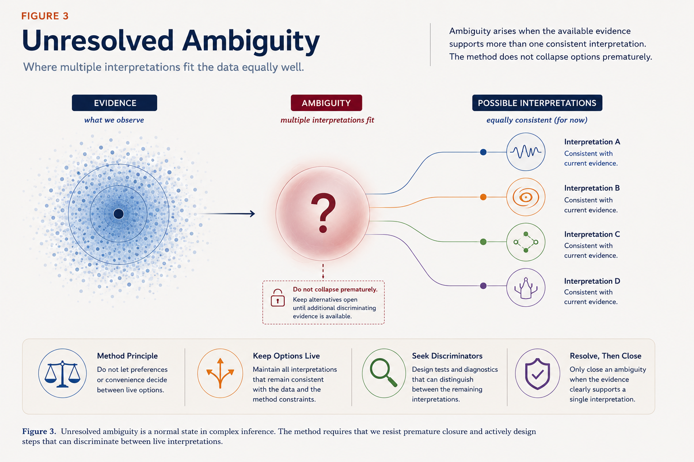
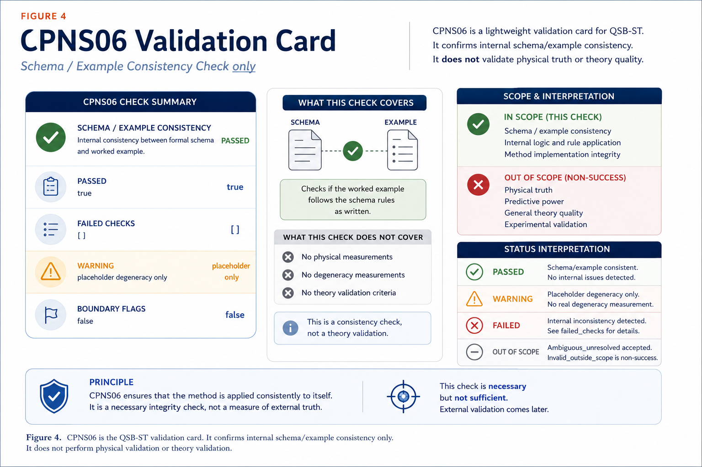

# From Diagnostic Fingerprints to Identity-Space Safeguards:
# A Method-Gate Note on QSB-ST WIFM, IDSPACE, and CPNS

Ralf Kemmann  
ORCID: 0009-0008-9932-3745

Version note: Working draft with PUBLIC01 publication draft figures and opening visual integrated. Final repository commit anchor should be updated before public release.



*Opening visual. Conceptual orientation for the QSB-ST method-gate note: relational diagnostic patterns may become readable, but readability is not yet identity resolution. IDSPACE and CPNS act as methodological safeguards before stronger interpretation.*


## Abstract

QSB-ST currently provides a controlled diagnostic workflow for asking whether relational fingerprints can be made geometrically readable without treating readability as identity resolution.

The useful step in the current repository line is not a leap from diagnostic structure to physics. It is a method gate: WIFM01-D closes a minimal synthetic fingerprint-metric route; BRIDGE-NATURE-01B turns that closure into a cautious gate; IDSPACE and CPNS then ask what must be defined before a readable diagnostic pattern can be interpreted as an identity-level statement. The result is a small but important safeguard: ambiguity and degeneracy are made visible instead of being silently absorbed into stronger language.

The current CPNS06 runner validates schema/example consistency only. Its summary reports `passed=true`, `failed_checks=[]`, accepts `ambiguous_unresolved` as a valid state, treats `invalid_outside_scope` as non-success for identity resolution, and keeps all claim-boundary flags false. Degeneracy readouts are placeholders only, not real degeneracy measurements.

## Plain-language orientation

The project starts from a simple caution. A diagnostic fingerprint can look structured. It can even be arranged so that distances, neighborhoods, or compact phase-like coordinates behave coherently. But that does not yet mean the fingerprint identifies what it represents.

QSB-ST therefore separates two questions:

- What can be read inside the diagnostic fingerprint space?
- What would be required before that reading counts as an identity-space statement?

This draft tells the current method-gate story. The positive content is the guardrail: QSB-ST is building explicit checks before stronger interpretation. The boundary is equally important: the current line is synthetic and diagnostic. It does not supply physical validation, Bridge confirmation, diagnostic specificity, wave-identity proof, or a physical spacetime result.

## Motivation: why diagnostic fingerprints need identity-space safeguards

Diagnostic spaces are tempting. Once a set of relational fingerprints can be compared with a metric, it becomes natural to talk about closeness, separation, ambiguity, neighborhoods, and geometric readability.

That language is useful, but it can overreach. A fingerprint may be same-looking for several reasons:

- the objects may really be equivalent under the current operational rule
- the representation may have erased identity-relevant information
- the chosen coordinates may be too coarse
- a label, gauge-like, or representation transform may have hidden a difference
- the diagnostic may simply not have enough information to decide

IDSPACE and CPNS are introduced as safeguards against that over-reading. IDSPACE asks what an identity object would mean in this synthetic diagnostic setting. CPNS asks how many alternatives remain compatible with the same constraints. Together they keep a readable fingerprint from being treated as identity resolution by default.

## Visual guide for the public note

The following publication draft figures are included as visual handrails for the reader. They are meant to make the red thread visible without making the method look more complete than it is. Each image should help the reader keep one distinction in view: diagnostic readability is interesting, but identity-level interpretation needs its own safeguards.

### Figure 1. Red thread through the method gate



Figure 1. The current QSB-ST method-gate route. WIFM01-D closes the minimal synthetic diagnostic line; BRIDGE-NATURE-01B prevents automatic escalation; IDSPACE and CPNS then introduce identity-space and ambiguity safeguards before CPNS04 and CPNS06 make the schema scaffold auditable.

The figure reads as a route map rather than a ladder of discoveries. It shows how the project moves from a closed diagnostic line into explicit safeguards before a narrow validator is allowed to check schema/example consistency.

Boundary: this draft figure supports sequence and orientation only; it does not imply physical validation, Bridge confirmation, diagnostic specificity, or a discovery pipeline.

### Figure 2. Fingerprint Space and Identity Space



Figure 2. Fingerprint-Raum / Fingerprint Space is the diagnostic space in which relational fingerprints may become readable. Identitaets-Raum / Identity Space is the operational layer where identity candidates are compared. The passage from one layer to the other requires declared maps, equivalence rules, and ambiguity handling.

The image makes the main conceptual guardrail visible: a diagnostic pattern can be readable below without being identity-resolved above. The gap between the layers is where IDSPACE definitions and CPNS ambiguity controls matter.

Boundary: this draft figure does not turn a geometric-looking diagnostic space into physical space, and it does not turn readability into identity resolution.

### Figure 3. Same-looking fingerprints and unresolved ambiguity



Figure 3. Same-looking or near-looking fingerprints may remain unresolved. In QSB-ST, ambiguity is kept as a valid state until identity definitions and CPNS constraints determine what alternatives remain possible.

The figure gives ambiguity a calm visual role. It is not a warning sign or a failed check; it is the disciplined result state used when current observables do not separate the alternatives.

Boundary: this draft figure does not make unresolved cases evidence for or against a physical interpretation.

### Figure 4. CPNS06 validation card



Figure 4. CPNS06 validates the CPNS04 schema and illustrative examples for internal consistency. The run passed its schema checks, but the degeneracy fields remain placeholders and all claim-boundary flags remain false.

The card is deliberately narrow. Its useful message is that the scaffold can be checked for internal consistency while the scientific claim flags remain closed.

Boundary: this draft figure supports the CPNS06 schema/example consistency result only; it does not imply real degeneracy measurement, physical validation, Bridge confirmation, or diagnostic specificity.

## Method-gate lineage

The red thread is:

```text
WIFM01-D closure
-> BRIDGE-NATURE-01B gate
-> IDSPACE-01
-> CPNS-02 / MaxEnt
-> CPNS03
-> CPNS04
-> CPNS05
-> CPNS06
```

### WIFM01-D closure

WIFM01-D closes the minimal WIFM line after WIFM01, WIFM01B, and WIFM01C. The closed line is a bounded synthetic diagnostic route. It shows that the minimal fingerprint metric can be run, audited, sensitivity-checked, and stress-checked within the toy setting.

The closure is a useful method milestone. It is not a reason to keep extending WIFM01 by inertia.

### BRIDGE-NATURE-01B gate

BRIDGE-NATURE-01B turns the WIFM01-D closure into a gate decision. It keeps the next step away from automatic WIFM01E expansion and away from WIFM02 or BRIDGE-NATURE-02.

The key routing statement is compact:

```text
WIFM01-D is closed.
No WIFM01E default.
WIFM02 remains closed.
BRIDGE-NATURE-02 remains closed.
Next preparation route: IDSPACE-01 plus CPNS-02 / MaxEnt.
```

### IDSPACE-01

IDSPACE-01 defines the operational identity-space vocabulary. It keeps Fingerprint-Raum and Identitaets-Raum separate. This is the central conceptual move: a point, distance, or neighborhood in fingerprint space is not automatically an identity-level object.

IDSPACE-01 also makes ambiguity a valid state. A comparison may return `same_identity_candidate`, `different_identity_candidate`, `ambiguous_unresolved`, or `invalid_outside_scope`.

### CPNS-02 / MaxEnt

CPNS-02 defines a Constraint-Preserving Null Space: the set of candidate alternatives that remain compatible with declared constraints. MaxEnt is treated as a conservative ambiguity probe, not as a way to import the desired identity.

The main question is not "which interpretation do we prefer?" The question is "how many alternatives remain after the definitions are fixed?"

### CPNS03

CPNS03 turns the definitions into a minimal schema acceptance plan. It requires explicit fields for identity-space records, fingerprint records, transform classes, equivalence decisions, CPNS degeneracy records, ambiguity classes, and claim-boundary flags.

This is where the method starts to become auditable as a record system.

### CPNS04

CPNS04 creates the minimal schema scaffold and illustrative synthetic example records. The examples include:

- `same_identity_candidate`
- `different_identity_candidate`
- `ambiguous_unresolved`
- `invalid_outside_scope`

These examples are documentation scaffolds only. They are not experimental data and not numerical science results.

### CPNS05

CPNS05 plans a minimal validation runner. Its scope is deliberately narrow: validate schema/example consistency, boundary flags, decision states, and scaffold compatibility.

### CPNS06

CPNS06 implements that minimal validation runner. It validates the CPNS04 schema and example records only. It does not compute physical results and does not quantify real degeneracy.

## Fingerprint-Raum / Fingerprint Space versus Identitaets-Raum / Identity Space

Fingerprint-Raum is the diagnostic space. It may contain compact phase-like coordinates, non-compact coordinate differences, local-form diagnostics, labels, warning flags, and ambiguity flags.

Identitaets-Raum is the operational identity layer. It asks what would count as the same candidate, a different candidate, an unresolved case, or an invalid comparison under declared rules.

The distinction matters because a diagnostic fingerprint can be same-looking without being identity-resolved. In the current method, same-looking means only that the current observables did not separate the candidates. It does not mean that the candidates are identical in a stronger sense.

This distinction is the heart of the safeguard.

## CPNS / MaxEnt as ambiguity and degeneracy safeguard

CPNS asks what remains possible when selected constraints are preserved. It is a diagnostic null-space idea: preserve the stated constraints, then count, bound, or mark unresolved the alternatives that still fit.

MaxEnt adds a disciplined background posture. It should expose what follows from declared constraints without adding hidden identity information. It must not smuggle in the target identity.

In this line, high, unresolved, or invalid degeneracy blocks later specificity language. Ambiguity is not a nuisance. It is a result state that protects the method from over-reading its own fingerprints.

The current repository has not yet measured real degeneracy. The schema carries placeholder/status fields so that later work can distinguish an actual measurement from a scaffold.

## CPNS06 validation result

CPNS06 validates schema/example consistency only.

The actual run output reports:

```text
block_id: QSB-ST-IDSPACE-CPNS06
runner_name: run_qsb_st_idspace_cpns06_minimal_schema_validation.py
run_id: minimal_schema_validation_open
passed: true
failed_checks: []
warning_checks:
  - degeneracy_readouts_are_placeholders_only:not_real_degeneracy_measurements
decision_states_found:
  - ambiguous_unresolved
  - different_identity_candidate
  - invalid_outside_scope
  - same_identity_candidate
ambiguity_valid_state: true
invalid_outside_scope_handled_as_non_success: true
degeneracy_measurement_status: placeholder_status_only
```

The boundary flags remain:

```text
bridge_confirmation=false
diagnostic_specificity_claim=false
physical_validation=false
wifm01e_opened=false
wifm02_opened=false
bridge_nature_02_opened=false
```

The result is useful because the scaffold can now be checked mechanically for its own internal discipline. It is not useful as a physics result.

## What this currently supports

The current line supports a bounded method statement:

QSB-ST has a controlled diagnostic workflow that separates readable fingerprints from identity resolution, makes ambiguity explicit, and validates a minimal schema scaffold for later diagnostic-record work.

It currently supports:

- a closed WIFM01-D method gate
- a BRIDGE-NATURE-01B routing gate
- operational IDSPACE definitions
- CPNS / MaxEnt degeneracy and ambiguity specifications
- a minimal schema scaffold
- a minimal schema/example consistency validator
- explicit false claim-boundary flags

The strongest current value is not a claim about nature. It is the discipline of the gate.

## What remains open

Open items include:

- no real data
- no real wavefunction input
- no real degeneracy measurement
- no entropy readout beyond scaffold placeholders
- no target-smuggling audit beyond schema checks
- no physical phase reconstruction
- no physical metric recovery
- no Hilbert-space reconstruction
- no diagnostic specificity claim
- no Bridge confirmation
- no WIFM02 or BRIDGE-NATURE-02 opening

The next hard question is whether future CPNS work can count or bound alternatives in a way that remains stable under hostile controls and does not import the desired conclusion.

## Claim boundary

Current status:

- CPNS06 validates schema/example consistency only.
- Degeneracy readouts are placeholders, not real degeneracy measurements.
- IDSPACE/CPNS is a methodological safeguard against over-reading diagnostic fingerprints.

Not claimed here:

- Bridge confirmation
- diagnostic specificity
- physical validation
- proof of wave identity
- physical spacetime geometry
- physical phase reconstruction
- physical metric recovery
- Hilbert-space reconstruction
- quantum-gravity evidence
- established spacetime emergence
- WIFM01E default
- WIFM02 opening
- BRIDGE-NATURE-02 opening

## Repository anchors

| Role | Repository anchor |
| --- | --- |
| WIFM01-D gate | `docs/QSB_ST_COMP01_WIFM01D_CONSOLIDATION_AND_GATE_NOTE.md` |
| BRIDGE-NATURE-01B gate | `docs/QSB_ST_BRIDGE_NATURE_01B_RED_TEAM_AND_CODEX_LITERATURE_SYNTHESIS_GATE.md` |
| IDSPACE/CPNS preparation | `docs/QSB_ST_IDSPACE01_CPNS02_MAXENT_PREPARATION_PLAN.md` |
| IDSPACE-01 definition | `docs/QSB_ST_IDSPACE01_IDENTITY_SPACE_DEFINITION_SPEC.md` |
| CPNS-02 / MaxEnt definition | `docs/QSB_ST_CPNS02_MAXENT_DEGENERACY_SPEC.md` |
| CPNS03 schema plan | `docs/QSB_ST_IDSPACE_CPNS03_MINIMAL_SCHEMA_ACCEPTANCE_TEST_PLAN.md` |
| CPNS04 scaffold note | `docs/QSB_ST_IDSPACE_CPNS04_MINIMAL_SCHEMA_SCAFFOLD_RESULT_NOTE.md` |
| CPNS05 runner plan | `docs/QSB_ST_IDSPACE_CPNS05_MINIMAL_SCHEMA_VALIDATION_RUNNER_PLAN.md` |
| CPNS06 result note | `docs/QSB_ST_IDSPACE_CPNS06_MINIMAL_SCHEMA_VALIDATION_RESULT_NOTE.md` |
| CPNS06 summary | `runs/QSB-ST-IDSPACE-CPNS06/minimal_schema_validation_open/summary.json` |
| CPNS06 readout | `runs/QSB-ST-IDSPACE-CPNS06/minimal_schema_validation_open/readout.md` |

Commit anchors currently named in the planning line:

| Commit | Meaning |
| --- | --- |
| `162097e` | WIFM01-D consolidation gate note anchor |
| `97b83cc` | Current local/public draft preparation endpoint before this visual integration |

## Literature/context policy

Literature belongs in the later note as background and comparison, not as evidence for QSB-ST.

Useful comparison areas may include action/phase language, geometric phase, information geometry, relational quantum descriptions, quantum reference frames, spectral or graph diagnostics, and emergent-geometry programs. These areas can help readers locate vocabulary and understand differences.

They should not be used to imply that QSB-ST has inherited support from established frameworks. A similar word is not a shared mechanism. A useful analogy is not a validation.

The literature section should therefore separate:

- project-internal method result
- background analogy
- open physical question

## Figure and AI transparency

The figures in this draft are explanatory visualizations for orientation. They are not empirical data, not numerical validation outputs, and not evidence for QSB-ST claims.

AI-assisted drafting, editorial structuring, preview generation, and generated explanatory figures were used as support tools. Scientific responsibility, conceptual decisions, claim boundaries, and final review remain with the author.

## References

References and repository-internal source documents are intentionally kept close to the method trail in this draft. The repository-anchor table above names the internal QSB-ST documents and run outputs that support the draft's method history.

External literature references will be finalized before public release. No external citation is used here as a source for the QSB-ST mechanism.

## Document apparatus

### List of Figures

- Opening visual. QSB-ST method-gate orientation
- Figure 1. Red thread through the method gate
- Figure 2. Fingerprint Space and Identity Space
- Figure 3. Same-looking fingerprints and unresolved ambiguity
- Figure 4. CPNS06 validation card

### List of Tables

- Table 1. Repository anchors for the PUBLIC01 method source trail
- Table 2. Commit anchors for release-preparation tracking

## Next steps

Before any public release:

- visually inspect the publication draft figures in the intended PDF or web context
- decide whether the opening visual remains a draft eyecatcher or is replaced by a cleaner text-overlaid version
- update the repository commit anchor to the final release commit
- run a final claim-risk grep
- produce a release PDF only after review
- decide separately whether to upload to Academia.edu, Zenodo, or both
