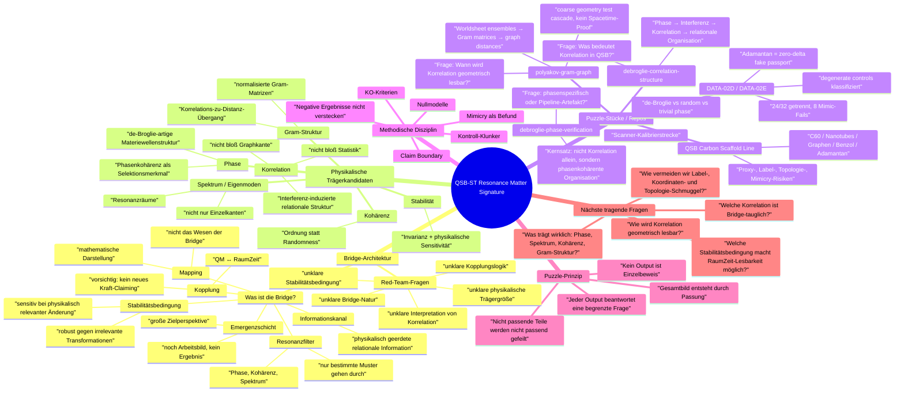

# QSB-ST Resonance Matter Signature — Mind-Map / Architekturkarte

Stand: 2026-05-15  
Zweck: Denk- und Architekturkarte, nicht Claim-Dokument.  
Claim Boundary: Diese Mind-Map ordnet vorhandene Puzzleteile und offene Architekturfragen. Sie ist kein Beweis für eine physikalisch etablierte Bridge.

---

## 1. Zentrale Architekturfrage

```text
Was ist die Bridge?
```

Arbeitsbild:

> Die QSB-Bridge ist vorläufig keine bloße Datenpipeline und kein direkt behauptetes neues Feld, sondern eine relationale Kopplungs-/Resonanz-/Stabilitätsschicht, in der bestimmte phasenkohärente, korrelationstragende Materiestrukturen geometrisch lesbar werden könnten.

Kurzform:

```text
Quantenmaterie
→ Phase / Kohärenz / Spektrum
→ Korrelation / Gram-Struktur
→ stabile relationale Organisation
→ geometrische Lesbarkeit
→ mögliche RaumZeit-QM-Bridge
```

---

## 2. Mermaid-Mindmap



---

## 3. Reviewer-Sicht: Was zeigen die bisherigen Linien?

| Linie | Rolle im Puzzle | Welche Red-Team-Frage berührt sie? | Was sie nicht leistet |
|---|---|---|---|
| `debroglie-correlation-structure` | Ursprungskette Phase → Interferenz → Korrelation | Was ist Korrelation in QSB? | Kein RaumZeit-Beweis |
| `debroglie-phase-verification` | Phasenspezifitäts-Test | Ist Struktur phasenspezifisch oder Pipeline-Artefakt? | Keine vollständige Bridge-Physik |
| `polyakov-gram-graph` | Gram→Graph→Geometry-Testkaskade | Wie wird Korrelationsstruktur geometrisch lesbar? | Keine fundamentale Raumzeitrekonstruktion |
| Carbon-Strang | Methoden- und Scanner-Kalibrierstrecke | Können wir komplexe Materieorganisation ohne Selbsttäuschung prüfen? | Keine physikalische Validierung |
| DATA-02D | Erster Scannerlauf gegen Controls | Trennt der Scanner Originale von Kontroll-Klunkern? | Keine robuste Volltrennung |
| DATA-02E | Mimicry-Prüfstand | Warum gehen 8 Controls durch? | Noch keine neue Diagnostik, sondern Revision Targets |

---

## 4. Architektur-Definition als Arbeitsstand

```text
Die Bridge ist physikalisch zunächst als relationale Kopplungs- und Selektionsschicht zu denken.
Ihre mathematische Beschreibung kann als Mapping erscheinen.
Ihr Trägermaterial sind Kandidaten wie Phase, Kohärenz, Spektrum, Korrelation und Gram-Struktur.
Ihre Stabilität zeigt sich nicht durch hohe Scores allein, sondern durch Kontrollfestigkeit,
Invarianz gegen irrelevante Transformationen und Sensitivität gegenüber physikalisch relevanten Änderungen.
```

Kurz:

```text
Bridge ≠ Score
Bridge ≠ Graph allein
Bridge ≠ Koordinate
Bridge ≠ Label

Bridge-Kandidat =
phasenkohärente, kontrollrobuste, geometrisch lesbare Korrelation
```

---

## 5. Die eigentliche Sollbruchstelle

Die wiederkehrende Red-Team-Kritik ist die Statikprüfung:

```text
unklare Bridge-Natur
unklare physikalische Trägergröße
unklare Kopplungslogik
unklare Stabilitätsbedingung
unklare Interpretation von Korrelation
```

Daraus folgt nicht:

```text
mehr Outputs um der Outputs willen
```

sondern:

```text
Architektur klären
→ Trägereigenschaften definieren
→ Puzzle-Stücke einordnen
→ erst dann gezielt neue Tests
```

---

## 6. Carbon-Strang als Kalibrierstrecke

Der Carbon-Strang soll nicht als Bridge-Beweis gelesen werden.

Richtige Rolle:

```text
Carbon scaffold line = worked methodological calibration case
```

Er zeigt exemplarisch:

- Scaffold-Bau mit klarer Proxy-Grenze
- Kontrollfamilien und Nullmodelle
- Scanner-Separation
- Mimicry-Warnungen
- negative/boundary findings
- diagnostische Revision statt Overclaiming

Reviewer-Antwort:

> Der Carbon-Strang zeigt nicht, dass die Bridge physikalisch funktioniert. Er zeigt, wie streng das Projekt methodisch arbeitet, bevor überhaupt stärkere Bridge-Claims zugelassen werden.

---

## 7. Nächster sinnvoller Theorieblock

Vorschlag:

```text
docs/QSB_ST_RESONANCE_MATTER_SIGNATURE_BRIDGE_ARCHITECTURE_NOTE.md
```

Ziel:

- Red-Team-Kritik als Architekturfragen formulieren
- vorhandene Repos/Testlinien als Puzzle-Stücke einordnen
- Bridge-Arbeitsbild definieren
- Trägerkandidaten sammeln
- Stabilitäts- und Kontrollkriterien formulieren
- Claim Boundary halten

Nicht Ziel:

- finaler Beweis
- neue Numerik
- weitere Detailvertiefung in einzelne Controls
- physikalische Validierung behaupten

---

## 8. Kurzfassung für den Projektkompass

```text
Wir produzieren keine Outputs um der Outputs willen.
Jeder Output muss ein Puzzleteil sein.

Ein Puzzleteil beantwortet:
1. Welche Bridge-Frage berührt dieser Block?
2. Welches Täuschungsrisiko kontrolliert er?
3. Welche Trägereigenschaft prüft er?
4. Was bleibt offen?
5. Wie passt er ins Gesamtbild?

Das Gesamtbild entsteht nicht aus einem Triumphlauf,
sondern aus der Passung vieler kontrollierter, begrenzter und claim-gebremster Puzzleteile.
```
