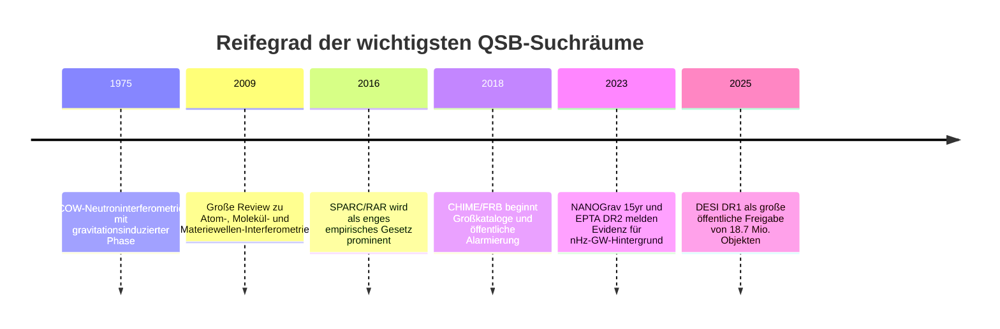
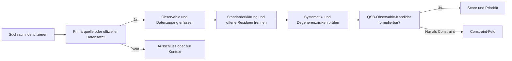

# Auditfähige Deep-Research-Analyse zu QSB-relevanten Suchräumen

## Executive Summary

**Explizite Annahme.** Obwohl die Nutzeranfrage den Gegenstand zunächst als „unspezifiziert“ beschreibt, ist für diese Ausarbeitung die hochgeladene Projektspezifikation maßgeblich. Ich behandle daher den Auftrag als **vergleichende, auditfähige Untersuchung von acht QSB-relevanten Suchräumen** für das Projekt *Quantum-Spacetime-Bridge* mit dem Ziel, **keinen Beweis**, sondern **empirisch brauchbare Prüfstände** und **No-Go-Grenzen** zu identifizieren. fileciteturn0file0

**Zentrale Schlussfolgerung.** Für eine erste, belastbare QSB-Scouting-Phase ergeben sich zwei unterschiedliche Spitzenkandidaten. **Mechanistisch am nächsten an der QSB-Leitidee** liegen Materiewellen- und Interferometrie-Experimente, weil sie direkt mit Phase, Interferenz, Kohärenz und Dekohärenz arbeiten. **Operativ am besten für einen sofort reproduzierbaren Scout-Run** ist jedoch das SPARC/RAR-Feld, weil dort offene, gut dokumentierte und unmittelbar auswertbare Datensätze vorliegen, während die zentrale empirische Struktur — die enge Kopplung zwischen baryonischer Verteilung und beobachteter Beschleunigung — etabliert, aber interpretativ umstritten ist. citeturn8academia1turn20academia1turn20academia3turn4view0

**Empfohlene Rangfolge für die nächste Arbeitsphase.** Nach wissenschaftlicher Nutzbarkeit, Datenzugänglichkeit, Reproduzierbarkeit und Overclaim-Risiko ergibt sich als robuste Reihenfolge: **SPARC/RAR**, **Materiewellen/Interferometrie**, **FRBs**, **Pulsar Timing Arrays**, **Spektroskopie/Fundamentalkonstanten** als Constraint-Feld, danach **starke Linsen**, **DESI/BAO/Hubble-Tension** und zuletzt **CMB-Anomalien**. Die niedrigere Platzierung von CMB und DESI bedeutet nicht „uninteressant“, sondern „für einen ersten QSB-Test zu degeneriert oder zu stark von globalen Modellannahmen abhängig“. citeturn20academia1turn22academia0turn6academia0turn39academia0turn14academia0turn30academia4

**Best First Practical Run.** Der beste erste praktische Scout-Run ist eine **präregistrierte Residualanalyse auf SPARC-Basis**: Zuerst wird die Standard-RAR auf den öffentlichen SPARC-Daten reproduziert; anschließend wird getestet, ob ein **vorab definierter relationaler Zusatzobservable-Kandidat** — also eine neue, geometrisch oder verteilungsbezogen definierte Größe, die *nicht* bloß lokale Radiusinformation dupliziert — die Residuen verbessert, ohne die Modellfreiheit unkontrolliert zu erhöhen. Dieser Test ist mit offenen Daten, klaren Nullhypothesen und vertretbarem Aufwand sofort umsetzbar. citeturn4view0turn20academia1turn20academia3turn22academia0

**Claim Boundary.** Die vorhandene Evidenz rechtfertigt derzeit **nur** Aussagen der Form: „dieses Feld ist ein QSB-relevanter Suchraum“ oder „dieses Feld setzt harte Constraints an jeden QSB-Kopplungsmechanismus“. Sie rechtfertigt **nicht** Aussagen der Form: „QSB erklärt Dunkle Materie“, „QSB erklärt PTA-Signale“, „QSB erklärt FRBs“ oder „QSB ist in kosmologischen Residuen bereits sichtbar“. Gerade die robustesten Felder zeigen, dass die Datenlage meist **empirisch stark**, die **Interpretationsfreiheit aber begrenzt und konfliktbeladen** ist. citeturn19academia3turn39academia0turn23academia1turn14academia0turn31academia0

## Auftrag, Scope und Annahmen

Die hochgeladene Projektspezifikation formuliert als Forschungsfrage, welche beobachteten Effekte, Messreihen und Datensätze als **QSB-relevante Suchräume** dienen können, wenn sie Phase, Interferenz, Kohärenz, Dekohärenz, relationale Kopplung, pfadabhängige Residuen oder offene öffentliche Daten enthalten. Außerdem verlangt sie eine strukturierte Feldanalyse, ein Bewertungsraster, eine Rangliste, einen No-Go-Bereich und einen Vorschlag für einen ersten Scout-Run. Genau diesen Rahmen übernimmt der vorliegende Bericht. fileciteturn0file0

Bewertet werden die im Prompt explizit genannten Felder: **Materiewellen-/Atom-/Molekül-/Neutroninterferometrie**, **SPARC/RAR**, **FRBs**, **Pulsar Timing Arrays**, **starke Gravitationslinsen mit Flux-Ratio-Anomalien**, **Spektroskopie/Fundamentalkonstanten**, **CMB-Anomalien** und **DESI/BAO/Hubble-Tension**. Wo deutsche Primärquellen verfügbar waren, wurden sie bevorzugt berücksichtigt; faktisch dominieren in fast allen acht Feldern jedoch englischsprachige Kollaborationspapiere, Datenfreigaben und Instrumentenseiten, weil dort die primären Mess- und Kataloginformationen publiziert werden. Das ist insbesondere bei SPARC, CHIME/FRB, NANOGrav/EPTA, Planck, DESI und ESPRESSO der Fall. fileciteturn0file0 citeturn4view0turn24view1turn40view1turn36view0turn4view3

Zur Einordnung der empirischen Reife ist die folgende knappe Chronologie hilfreich:

Die Chronologie zeigt, dass die Felder unterschiedlich weit „instrumentalisiert“ sind: Interferometrie ist methodisch alt und mechanistisch nah an QSB; SPARC und FRBs sind offen-datenstark; PTAs sind hochpräzise, aber modell- und pipeline-intensiv; Planck und DESI sind exzellent, aber für einen ersten QSB-Angriff globaler und stärker degeneriert. citeturn33search4turn8academia0turn20academia1turn6academia0turn39academia0turn30academia4

## Methodik und Audit-Trail

Die Recherche wurde als **quellenpriorisierte Screen-and-rank-Analyse** durchgeführt. Priorisiert wurden erstens **offizielle Kollaborations- und Instrumentenseiten** mit Datenzugang, zweitens **Kollaborations- oder Primärpapiere** zu Datenfreigaben und Resultaten, drittens **überblicksartige Review-Papers**, wenn sie für Interferometrie, Systematik oder Interpretation unverzichtbar sind. Tertiärquellen wurden nicht als Ergebnisbasis, sondern höchstens als Wegweiser zu Primärquellen genutzt. Ausgeschlossen wurden meinungsbasierte Stücke ohne Primärbezug sowie stark spekulative Sekundärdeutungen ohne belastbaren Datenkern. citeturn4view0turn24view1turn40view1turn36view0turn14academia0turn30academia4

Die Suchstrategie war feldspezifisch, aber nach einem einheitlichen Schema aufgebaut: **Was ist das relevante Observable? Wo liegen öffentliche Daten? Wie stark ist die etablierte Standarderklärung? Wo liegen echte Residuen, wo nur Interpretationskonflikte? Und lässt sich daraus ein vorregistrierbarer, falsifizierbarer QSB-Test ableiten?** Besonders stark gewichtet wurden deshalb Datenzugänglichkeit, Reproduzierbarkeit, Trennschärfe gegenüber Standardphysik und das Risiko, aus statistischen Zufälligkeiten oder hochdimensionalen Fits falsche Signale zu „lesen“. fileciteturn0file0 citeturn20academia3turn35academia2turn14academia0turn15academia0

Der Prüfpfad lässt sich so zusammenfassen:

**Reproduzierbarer Audit-Trail, repräsentative Stichprobe.** Alle unten aufgeführten URLs wurden am **2026-06-30** abgerufen. Die Auswahl ist nicht die gesamte Recherchehistorie, sondern die tragende, reproduzierbare Quellenspur für die Schlussfolgerungen dieses Berichts.

| Feld | Verwendete Suchanfrage | Zentrale URLs | Auswahlrationale |
|---|---|---|---|
| Materiewellen/Interferometrie | `atom interferometry review matter-wave decoherence` | `https://arxiv.org/abs/1109.5937` · `https://arxiv.org/abs/2101.08216` | Review-Backbone zu Interferenz, Moleküldekohärenz, experimentellen Grenzen |
| SPARC/RAR | `SPARC database galaxy rotation curves official` | `https://astroweb.cwru.edu/SPARC/` · `https://arxiv.org/abs/1609.05917` · `https://arxiv.org/abs/1803.00022` | Offizielle Datenbasis plus Primärarbeiten zu RAR und Residuen |
| FRBs | `CHIME FRB catalog official data release` | `https://www.chime-frb.ca/catalog` · `https://arxiv.org/abs/2408.09013` · `https://arxiv.org/abs/2410.22468` | Öffentliche Kataloge, Alert-Metadaten, großes path-dependent Beobachtungsfeld |
| PTAs | `NANOGrav 15-year data release official` | `https://nanograv.org/science/data` · `https://arxiv.org/abs/2306.16213` · `https://arxiv.org/abs/2306.16217` · `https://www.epta.eu.org/` | Offizielle Datenfreigaben und Evidenzpapiere aus unabhängigen Kollaborationen |
| Linsen | `CASTLES gravitational lens database official` | `https://lweb.cfa.harvard.edu/castles/` · `https://arxiv.org/abs/astro-ph/0111456` · `https://arxiv.org/abs/1701.05188` | Öffentlich zugängliche Linsendaten und klassische/neuere Substruktur-Tests |
| Fundamentalkonstanten | `variation fundamental constants atomic clocks quasar` | `https://www.eso.org/public/teles-instr/paranal-observatory/vlt/vlt-instr/espresso/` · `https://arxiv.org/abs/2112.05819` · `https://arxiv.org/abs/2302.04565` | Harte Constraint-Felder aus Quasarspektroskopie und Uhrenmetrologie |
| CMB-Anomalien | `Planck 2018 isotropy statistics CMB anomalies` | `https://arxiv.org/abs/1906.02552` · `https://arxiv.org/abs/2509.03720` | Offizieller Referenzanker plus spätere Reanalysen zur Signifikanzrobustheit |
| DESI/BAO/Hubble | `DESI DR1 data release dark energy` | `https://data.desi.lbl.gov/doc/releases/dr1/` · `https://arxiv.org/abs/2503.14745` · `https://arxiv.org/abs/2405.04216` · `https://arxiv.org/abs/2309.05618` · `https://arxiv.org/abs/2112.04510` | Öffentliche Freigabe, Modellrekonstruktionen und Hubble-Tension-Kontext |

## Bewertungsmatrix und Rangliste

Die folgende Matrix verwendet das im Projektprompt verlangte 0–5-Raster: **QSB-mechanistische Nähe**, **Datenzugänglichkeit**, **Reproduzierbarkeit**, **Abgrenzbarkeit von Standardphysik**, **Overclaim-Risiko** mit 5 = gering, **Aufwand für einen Minimaltest** mit 5 = gering und **Potenzial für ein klar definiertes QSB-Observable**. Die Punktwerte sind eine synthetische Bewertung auf Basis der unten erläuterten Evidenz, nicht Messwerte aus den Quellen selbst. fileciteturn0file0

| Feld | Mechanistische Nähe | Datenzugänglichkeit | Reproduzierbarkeit | Abgrenzbarkeit | Overclaim-Risiko | Minimaltest-Aufwand | Observable-Potenzial | Summe | Priorität |
|---|---:|---:|---:|---:|---:|---:|---:|---:|---|
| SPARC / RAR | 3 | 5 | 5 | 3 | 3 | 5 | 4 | **28** | **hoch** |
| Materiewellen / Interferometrie | 5 | 2 | 3 | 4 | 4 | 2 | 5 | **25** | **hoch** |
| Spektroskopie / Konstanten | 3 | 3 | 4 | 5 | 5 | 3 | 2 | **25** | **mittel-hoch** |
| FRBs | 4 | 4 | 4 | 2 | 2 | 3 | 4 | **23** | **mittel-hoch** |
| Pulsar Timing Arrays | 4 | 4 | 4 | 2 | 2 | 2 | 4 | **22** | **mittel** |
| Gravitationslinsen | 3 | 3 | 3 | 2 | 2 | 2 | 3 | **18** | **mittel-niedrig** |
| DESI / BAO / Hubble | 2 | 5 | 5 | 1 | 1 | 3 | 2 | **19** | **niedrig** |
| CMB-Anomalien | 2 | 5 | 5 | 1 | 1 | 4 | 2 | **20** | **niedrig** |

**Interpretation der Rangliste.** Dass **SPARC/RAR** vor **Interferometrie** liegt, ist kein physikalisches Vorrangurteil zugunsten galaktischer Skalen, sondern das Ergebnis eines pragmatischen Audit-Kriteriums: offene Daten, sofortige Reanalyse, klarer Nulltest. Dass **Interferometrie** dennoch als mechanistisch stärkster QSB-Suchraum gilt, folgt direkt daraus, dass dort Phasenbildung, Kohärenzverlust und Interferenzstabilisierung nicht metaphorisch, sondern experimentell primär sind. **Spektroskopie/Fundamentalkonstanten** rangiert relativ hoch, obwohl es kein ideales „Entdeckungsfeld“ ist, weil dieses Feld den härtesten empirischen Zaun um jeden QSB-Kopplungsmechanismus zieht. citeturn20academia1turn20academia3turn8academia1turn12academia0turn10academia2

Die niedrige Platzierung von **CMB** und **DESI/Hubble** ist ebenfalls bewusst. Beide Bereiche beruhen auf sehr hochwertigen Daten, aber ein erster QSB-Test würde dort fast zwangsläufig in hochdimensionale globale Modellvergleiche, a-posteriori-Statistiken oder multiexperimentelle Kombinationsabhängigkeiten hineingeraten. Das erhöht die Chance, dass ein scheinbar „QSB-relevantes“ Signal am Ende nur eine Projektion von Maskenwahl, Priors, kosmischer Varianz oder Datensatzkombinationen ist. citeturn14academia0turn15academia0turn30academia4turn30academia7turn31academia0

## Evidenz und Feldanalysen

Die folgende Vergleichstabelle verdichtet die acht Suchräume auf die jeweils entscheidenden auditrelevanten Punkte.

| Feld | Messgrößen / Observables | Öffentliche Datenlage | Hauptkonflikt | Urteil |
|---|---|---|---|---|
| Materiewellen / Interferometrie | Phasenschub, Fringe-Visibility, Dekohärenzrate, Pfadtrennung | Gut auf Papier-/Supplement-Ebene, aber uneinheitlich bei Rohdaten | Standard-QM erklärt die meisten Effekte bereits sehr gut | Mechanistisch **exzellent**, operativ **mittel** |
| SPARC / RAR | \(g_{\mathrm{obs}}\), \(g_{\mathrm{bar}}\), Rotationskurven, Residuen | Sehr gut; offizielle SPARC-Daten und RAR-Links vorhanden | Streit liegt in der Interpretation, nicht im Datensatz selbst | **Bester erster Reanalyse-Prüfstand** |
| FRBs | DM, RM, Scattering, Lokalisation, Host-Redshift | Gut; CHIME-Kataloge, Alerts, TNS/öffentliche Metadaten | Zerlegung von DM/RM in MW, IGM, Halo, Host ist systematisch heikel | **Starkes mittleres Feld** |
| PTAs | Timing-Residuals, Hellings-Downs-Korrelation, Spektren | Gut; NANOGrav und EPTA mit öffentlichen Releases | Quelle des Hintergrunds und Rauschmodellierung bleiben offen | Präzise, aber **pipeline-intensiv** |
| Spektroskopie / Konstanten | \(\Delta\alpha/\alpha\), \(\Delta\mu/\mu\), Frequenzverhältnisse von Uhren | Teilweise gut bis sehr gut, aber oft instrument- und modellgetrieben | Hauptwert ist Constraint, nicht positive Anomalie | **Pflichtfeld für QSB-Grenzen** |
| Linsen | Bildpositionen, Flux-Ratios, Narrow-line/Mid-IR-Anomalien | Mittel; hilfreiche Kataloge, aber oft objektspezifische Modellierung | Baryonen und line-of-sight-Strukturen imitieren Substruktur | Später harter Test, nicht erster |
| CMB-Anomalien | Low-\(\ell\)-Ausrichtungen, \(S_{1/2}\), Parität, Hemisphärenasymmetrie | Sehr gut | a-posteriori-Statistik und kosmische Varianz dominieren | Für frühe QSB-Tests ungeeignet |
| DESI / BAO / Hubble | \(D_M/r_d\), \(D_H/r_d\), \(H_0\), \(w(z)\), BAO-Residuen | Exzellent | Ergebnis hängt stark an Modell-/Datensatzkombinationen | Zu global und degeneriert für Start |

### Verdichtete Detailanalyse je Feld

**Materiewellen-, Atom-, Molekül- und Neutroninterferometrie.** Dieses Feld ist der direkteste Anschluss an die QSB-Kernidee, weil hier gerade *Phasenfähigkeit*, *interferierende Pfade* und *Dekohärenz* die primären Observablen sind. Die große Übersichtsarbeit von Hornberger, Gerlich, Haslinger, Nimmrichter und Arndt macht explizit deutlich, dass komplexe Molekül- und Clusterinterferenz heute als empfindlicher Prüfstand für Dekohärenz und für die Grenze stabiler Quantensuperpositionen genutzt wird; die neuere Review zu experimenteller Dekohärenz in der Molekülinterferometrie zieht genau denselben Schluss. Klassische Referenzpunkte wie die COW-Neutroninterferometrie und neuere atominterferometrische Gravitationsphasen — bis hin zum 2022 berichteten gravitativen Aharonov-Bohm-Setup — zeigen, dass gravitations- und potentialinduzierte Phasenverschiebungen experimentell fein aufgelöst werden können. Für QSB ist das ideal, weil jede Hypothese hier als Zusatzstruktur auf **Phase, Visibility, Decoherence-Rate oder Pfadstabilität** formuliert werden muss. Der Nachteil ist praktisch: Rohdaten und standardisierte offene Reanalysepakete sind deutlich schlechter verfügbar als in SPARC oder NANOGrav. citeturn8academia0turn8academia1turn33search4turn38search4turn38search8

**SPARC / Galaxienrotationskurven / Radial Acceleration Relation.** Die offizielle SPARC-Seite stellt Photometrie, H I/H\(\alpha\)-Rotationskurven und Massenmodelle für **175 Scheibengalaxien** sowie direkte Links zur RAR und zu Fits bereit; das macht das Feld außerordentlich reanalysefreundlich. Die Primärarbeit zur RAR berichtet, dass **2693 Messpunkte in 153 Galaxien** eine enge Relation zwischen beobachteter und aus Baryonen erwarteter Beschleunigung bilden. Eine nachfolgende Feldanalyse an **175 individuellen SPARC-Galaxien** fand nach Marginalisierung über Massen-Leuchtkraft-Verhältnisse, Distanzen und Neigungen eine Residualstreuung von nur **0,057 dex** um die mittlere Relation. Genau darin liegt die QSB-Relevanz: nicht deshalb, weil die RAR „QSB beweise“, sondern weil sie ein außergewöhnlich klares, quantitatives Beispiel einer **stabilen relationalen Struktur** zwischen sichtbarer Materieverteilung und Dynamik liefert. Der Konflikt liegt vollständig auf der Interpretationsebene: MOND-nahe Lesarten sehen hier eine tiefe empirische Gesetzmäßigkeit, während \(\Lambda\)CDM-orientierte Arbeiten zeigen, dass eine RAR qualitativ und teils quantitativ auch aus baryonischer Rückwirkung und Halo-Relaxation entstehen kann. Für einen ersten QSB-Scout-Run ist das gerade gut, weil der Datensatz stark, offen und konfliktbewusst ist. citeturn4view0turn20academia1turn20academia3turn22academia0turn22academia3

**Fast Radio Bursts.** FRBs sind ein ausgeprägter **pfadabhängiger relationaler Suchraum**, weil Dispersion Measure, Rotation Measure und Scattering Linienintegrale durch Milchstraße, Halos, IGM, Host und Quellumgebung sind. Der zweite CHIME/FRB-Katalog umfasst **4539 Bursts aus 3641 Quellen** im Zeitraum 2018–2023 und liefert damit erstmals ein wirklich populationsstarkes Material. Zusätzlich beschreibt das öffentliche `frb-voe`-System der CHIME/FRB-Kollaboration, dass öffentliche Alerts samt Metadaten typischerweise innerhalb von etwa **13 Sekunden** veröffentlicht werden und über eine sortierbare Datenbank samt JSON zugänglich sind. Das ist für Auditierbarkeit und Reproduzierbarkeit ein großer Pluspunkt. Wissenschaftlich heikel bleibt jedoch die Zerlegung der beobachteten Linienintegrale: Simulationen und Host-Studien zeigen, dass Host-Halos, foreground halos und circumsource-Medien sowohl DM als auch Scattering und RM wesentlich beeinflussen können. Genau deshalb ist FRB-Kosmologie spannend, aber für QSB nur dann sauber, wenn man einen präregistrierten Residualtest formuliert, der **nicht** unkontrolliert Host- und Pfadterme vermischt. citeturn6academia0turn26academia1turn27academia0turn27academia1turn27academia2

**Pulsar Timing Arrays.** PTAs gehören zu den präzisesten relationalen Raumzeitdatensätzen überhaupt, weil die Daten gerade aus der Korrelation von Ankunftszeit-Residuals über ein galaktisches Pulsarnetz entstehen. NANOGrav berichtet im 15-Jahres-Datensatz **mehrere Evidenzlinien** für ein stochastisches, zwischen **67 Pulsaren** korreliertes Signal mit der erwarteten **Hellings-Downs-Korrelation**; das gleiche Release umfasst Beobachtungen und Timing-Modelle von **68 Millisekundenpulsaren** und wird von einer öffentlichen Datenseite mit Zenodo-Repositories, kalibrierten Datensätzen und sogar Rohdaten-Zugängen flankiert. Die EPTA-DR2-Dokumentation ergänzt dies mit **25 Millisekundenpulsaren** über etwa **25 Jahre**. Für QSB ist das attraktiv, weil man hier extrem präzise, explizit relationale Residuen hat. Zugleich ist das Feld für frühe Scouting-Zwecke schwierig: derselbe Datensatz kann astrophysikalisch durch SMBH-Binärpopulationen, in Teilen aber auch durch exotischere Quellen modelliert werden; kontinuierliche Wellenkandidaten in EPTA sind ausdrücklich noch nicht schlüssig. Damit ist PTA empirisch hochklassig, aber methodisch nichts für eine unkalibrierte „erste Berührung“. citeturn39academia0turn39academia1turn40view1turn23academia0turn24view1turn24view2

**Spektroskopie und fundamentale Konstanten.** Dieses Feld ist weniger ein unmittelbarer Entdeckungsraum als ein **Constraint-Feld**, aber gerade deshalb unverzichtbar. ESPRESSO ist offiziell mit sehr hoher spektraler Auflösung angegeben, und auf der ESO-Instrumentenseite wird die **Messung möglicher Variationen physikalischer Konstanten** ausdrücklich als eines der Science Goals genannt. Die erste ESPRESSO-Analyse zu HE 0515−4414 fand \(\Delta\alpha/\alpha = 1.3 \pm 1.3_{\rm stat} \pm 0.4_{\rm sys}\) ppm und kombinierte mit weiteren mitigierten Datensätzen einen gewichteten Mittelwert konsistent mit **keiner Variation**. Zeitgleich zeigen Arbeiten zu Atomuhren und Uhrennetzwerken, dass sowohl zeitliche als auch transiente Variationen von \(\alpha\) und \(\mu\) extrem hart begrenzt sind. Für QSB heißt das: Jeder Kopplungsmechanismus, der an Phasen, Interferenz oder relationale Strukturen ansetzt, darf **nicht** implizit eine Spektrallinien- oder Uhrendrift erzeugen, die über diese existierenden Grenzen hinausgeht. Wichtig für die Zuverlässigkeitsbewertung ist, dass aus der Quasarspektroskopie gerade nicht nur „Nullresultate“ folgen, sondern auch ein methodischer Warnhinweis: Modell-Nicht-Eindeutigkeit und Wellenlängenkalibration können scheinbare Signale erzeugen oder verbreitern. citeturn37view1turn12academia0turn10academia2turn34academia2turn35academia2

**Gravitationslinsen / Flux-Ratio-Anomalien.** Die CASTLES-Datenbank ist für dieses Feld enorm hilfreich, weil sie explizit Informationen und Daten zu Linsensystemen bereitstellt und sogar einen **downloadbaren FITS-Tarball** anbietet. Klassische Arbeiten wie Dalal & Kochanek argumentierten, dass Substrukturanteile in Linsengalaxien aus Flux-Anomalien direkt erschlossen werden können; spätere Arbeiten zeigten jedoch, dass **line-of-sight-Strukturen** und baryonische Komponenten in den Linsen selbst eine ähnlich wichtige Rolle spielen können. Neuere Studien zu Narrow-line-Flux-Ratios und zu erweiterten Bögen zeigen, dass Präzision und Robustheit zunehmen, sobald man Quellenregionen verwendet, die weniger von Stern-Mikrolensing betroffen sind oder zusätzliche Information über den glatten Hauptdeflektor tragen. Für QSB ist das als später Prüfstand stark, weil Bild- und Pfadrela­tionen hier sehr konkret sind. Für den ersten Scout-Run ist das Feld aber zu modellabhängig und zu anfällig für Verwechslungen zwischen Subhalo-, Baryonen- und line-of-sight-Effekten. citeturn17view0turn19academia0turn18academia0turn19academia2turn16academia3turn18academia3

**CMB-Anomalien / großskalige Korrelationen.** Plancks finale Isotropie- und Statistikarbeit betont zweierlei zugleich: Einerseits stimmen die CMB-Daten insgesamt sehr gut mit den gaußschen Vorhersagen des \(\Lambda\)CDM-Modells überein; andererseits bestätigen die Temperaturkarten weiterhin mehrere großskalige „Anomalien“. Genau hier liegt aber auch das Problem: Schon Planck selbst betont Residualsystematiken und Grenzen der Simulierbarkeit, besonders in der Polarisation. Neuere Reanalysen mit fast voller Himmelabdeckung zeigen, dass für einige vielzitierte Anomalien die Signifikanz beim Übergang zu kleineren Masken von etwa **3σ auf etwa 2σ** sinkt, während andere — etwa Quadrupol/Oktopol-Ausrichtung — ungefähr im Bereich von **3σ** bleiben können. Für QSB ist das theoretisch reizvoll, praktisch aber ein klassischer Hochrisikobereich für a-posteriori-Auswahl, Look-elsewhere-Effekte und kosmische Varianz. Das ist genau der Typ Suchraum, den man **nicht** als Startpunkt wählen sollte. citeturn14academia0turn15academia0turn15academia3

**DESI / BAO / Hubble-Tension / kosmologische Struktur.** DESI DR1 ist als Datensatz hervorragend: Die offizielle DR1-Dokumentation beschreibt **18,7 Millionen Objekte**, darunter etwa **13,1 Millionen Galaxien**, **1,6 Millionen Quasare** und **4 Millionen Sterne**, und bietet öffentlich dokumentierten Zugang. Wissenschaftlich ist der Raum aber für frühe QSB-Scouting-Arbeit zu groß. Schon die DESI-Kollaborationsarbeiten und nahestehende Rekonstruktionen zeigen, dass Hinweise auf dynamische Dunkle Energie besonders dann wachsen, wenn BAO mit CMB- und Supernova-Datensätzen kombiniert werden; zugleich betonen andere Analysen, dass BAO-only oder Full-Shape-Ergebnisse deutlich eher mit \(\Lambda\)CDM kompatibel bleiben können. Hinzu kommt die Hubble-Tension-Literatur: Riess und Kolleg:innen berichten weiterhin einen lokalen Wert um **73 km/s/Mpc** mit etwa 1 km/s/Mpc Unsicherheit, während Reviews wie Freedman & Madore die Notwendigkeit systematischer Härteprüfungen hervorheben. Kurz gesagt: Das Feld ist empirisch exzellent, aber ein QSB-Test würde hier fast sofort in globale Kosmologie, externe Priors und Modellkombinationen abrutschen. citeturn4view3turn30academia4turn30academia7turn30academia3turn31academia1turn31academia0

## Empfehlungen, Claim Boundary und offene Fragen

**Empfehlung zum ersten Untersuchungsfeld.** Wenn die Leitfrage lautet, *welcher Suchraum soll praktisch zuerst untersucht werden*, dann ist die Antwort **SPARC/RAR**. Wenn die Leitfrage stattdessen lautet, *welcher Suchraum ist QSB-mechanistisch am nächsten*, dann ist die Antwort **Materiewellen-/Interferometrie**. Diese Zweiteilung ist kein Widerspruch, sondern ein methodischer Vorteil: SPARC liefert die schnellste saubere Reanalyse, Interferometrie liefert die schärfste physikalische Nähe zur zugrunde liegenden QSB-Idee. citeturn4view0turn20academia1turn8academia1

**Recommended QSB Observable Contract.** Ein brauchbarer QSB-Observable-Kandidat sollte vor jeder Analyse fünf Bedingungen erfüllen: Er sollte **dimensionless oder sauber normiert** sein; er sollte **zusätzlich** zu einer Standardmodellvorhersage definiert werden, nicht an deren Stelle; er sollte **präregistrierte** Freiheitsgrade und Auswahlregeln haben; er sollte auf **öffentlichen Daten** reproduzierbar testbar sein; und seine Güte sollte auf **out-of-sample-Vorhersage** oder auf einer mit Strafterm versehenen Modellselektion beruhen, nicht auf bloßem In-sample-Bessermachen. Im SPARC-Fall hieße das: Erst RAR reproduzieren, dann einen einzigen relationalen Zusatzterm testen. Im Interferometrie-Fall hieße das: Einen vorab definierten Zusammenhang zwischen Pfadgeometrie, Visibility-Verlust und einem zusätzlichen Stabilisierungsterm testen. citeturn20academia3turn22academia0turn8academia1turn35academia2

**No-Go und Claim Boundary.** Nicht zulässig wären im jetzigen Evidenzstand Behauptungen, dass QSB die RAR „erklärt“, dass PTA-Hintergrundsignale „QSB-Hinweise“ seien, dass FRB-DM-Reste bereits eine neue relationale Physik zeigten oder dass CMB-Ausrichtungen eine bevorzugte kosmische Struktur „beweisen“. Ebenfalls unzulässig wäre jeder QSB-Mechanismus, der Größenordnungen erzeugt, die durch Quasarspektroskopie oder Atomuhren bereits ausgeschlossen sind. Saubere QSB-Arbeit muss daher mit **Residualanalysen**, **Constraint-Feldern** und **präregistrierten Observable-Kandidaten** beginnen, nicht mit globalen ontologischen Deutungen. citeturn39academia0turn23academia1turn12academia0turn10academia2turn14academia0

**Best First Practical Run.** Der praktisch beste nächste Schritt ist ein **SPARC Scout-Run in drei Stufen**. Erstens: offizielle SPARC-Daten importieren und die publizierte RAR samt Standard-Fits exakt reproduzieren. Zweitens: ein einziges, a priori festgelegtes QSB-Observable definieren, beispielsweise eine **nichtlokale baryonische Konfigurationsgröße**, die über die rein lokale baryonische Beschleunigung hinausgeht, aber noch vollständig aus den öffentlichen Profilen ableitbar bleibt. Drittens: testen, ob dieser Zusatzterm die Residuen verbessert, **nach** Marginalisierung über die üblichen astrophysikalischen Freiheitsgrade und **mit** strikter Komplexitätsstrafe. Die kleinste wissenschaftlich saubere Minimalfrage lautet dann: **„Bleiben die SPARC-RAR-Residuals strukturarm, wenn man einen vorab definierten relationalen Zusatzobservable-Kandidaten zulässt?“** Diese Frage ist beantwortbar, ohne QSB zu behaupten, und sie produziert sofort ein auditfähiges Ja/Nein-Resultat. citeturn4view0turn20academia1turn20academia3turn22academia0

**Erforderliche Klärungsinputs für den anschließenden themenspezifischen Scout-Run.** Damit der nächste Schritt nicht in Beliebigkeit kippt, werden noch vier Inputs benötigt: erstens eine **formale Minimaldefinition** des QSB-Zusatzterms; zweitens eine **verbotsartige Liste**, was dieser Term ausdrücklich *nicht* tun darf, vor allem im Licht der Spektroskopie-/Uhr-Constraints; drittens eine **präregistrierte Modellkomplexität** mit fester Parameterzahl; und viertens ein **Entscheidungskriterium**, ab wann eine Residualverbesserung als echte Vorhersageverbesserung und nicht als Overfit gilt. Ohne diese Inputs bleibt QSB im Stadium einer Suchheuristik; mit ihnen wird es zu einem testbaren Observable-Programm. fileciteturn0file0 citeturn12academia0turn10academia2turn35academia2

**Offene Fragen und Grenzen dieser Recherche.** Erstens sind in der Interferometrie Rohdaten und einheitliche Reanalyse-Pipelines deutlich schlechter standardisiert als in SPARC, CHIME oder NANOGrav. Zweitens bleibt bei FRBs die Zerlegung von Host-, Halo-, IGM- und circumsource-Beiträgen der empfindlichste Unsicherheitsblock. Drittens sind PTA-Signale zwar stark, aber für frühe QSB-Zusatzmodelle methodisch anspruchsvoll. Viertens sind CMB und DESI hochrangige spätere Prüfstände, aber für den Start zu degeneriert. Diese Grenzen schmälern nicht die Relevanz der Felder; sie erklären die gewählte Priorisierung. citeturn8academia1turn27academia0turn27academia2turn39academia0turn14academia0turn30academia4