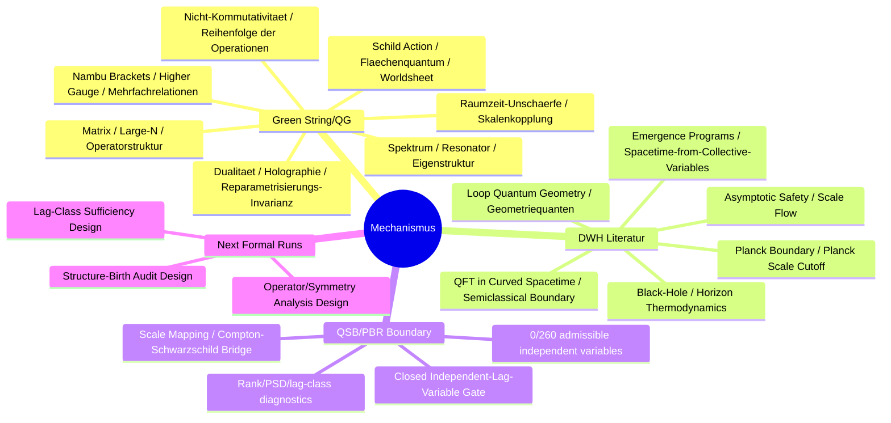

# Mechanism Mindmap Mermaid

```mermaid
mindmap
  root((Mechanismus))
    Green String/QG
      Raumzeit-Unschaerfe / Skalenkopplung
      Schild Action / Flaechenquantum / Worldsheet
      Matrix / Large-N / Operatorstruktur
      Nambu Brackets / Higher Gauge / Mehrfachrelationen
      Dualitaet / Holographie / Reparametrisierungs-Invarianz
      Nicht-Kommutativitaet / Reihenfolge der Operationen
      Spektrum / Resonator / Eigenstruktur
    DWH Literatur
      Loop Quantum Geometry / Geometriequanten
      Asymptotic Safety / Scale Flow
      QFT in Curved Spacetime / Semiclassical Boundary
      Emergence Programs / Spacetime-from-Collective-Variables
      Black-Hole / Horizon Thermodynamics
      Planck Boundary / Planck Scale Cutoff
    QSB/PBR Boundary
      Closed Independent-Lag-Variable Gate
      0/260 admissible independent variables
      Rank/PSD/lag-class diagnostics
      Scale Mapping / Compton-Schwarzschild Bridge
    Next Formal Runs
      Lag-Class Sufficiency Design
      Operator/Symmetry Analysis Design
      Structure-Birth Audit Design
```

Claim boundary: this mindmap is brainstorming only and does not release a mechanism claim.
