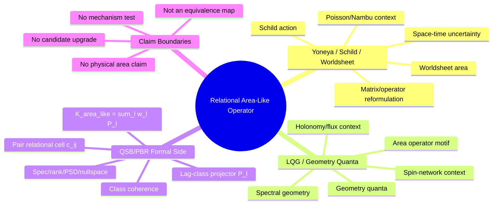

# Relational Area Operator Mindmap

```mermaid
mindmap
  root((Relational Area-Like Operator))
    Yoneya / Schild / Worldsheet
      Space-time uncertainty
      Schild action
      Worldsheet area
      Matrix/operator reformulation
      Poisson/Nambu context
    LQG / Geometry Quanta
      Area operator motif
      Geometry quanta
      Spin-network context
      Spectral geometry
      Holonomy/flux context
    QSB/PBR Formal Side
      Pair relational cell c_ij
      Lag-class projector P_l
      K_area_like = sum_l w_l P_l
      Spec/rank/PSD/nullspace
      Class coherence
    Claim Boundaries
      Not an equivalence map
      No physical area claim
      No mechanism test
      No candidate upgrade
```

This mindmap is design vocabulary only.
