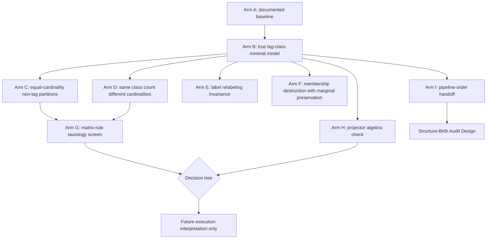

# Lag-Class Sufficiency Flowchart

```mermaid
flowchart TD
  A[Arm A: documented baseline] --> B[Arm B: true lag-class minimal model]
  B --> C[Arm C: equal-cardinality non-lag partitions]
  B --> D[Arm D: same class count different cardinalities]
  C --> G[Arm G: matrix-rule tautology screen]
  D --> G
  B --> E[Arm E: label relabeling invariance]
  B --> F[Arm F: membership destruction with marginal preservation]
  B --> H[Arm H: projector algebra check]
  B --> I[Arm I: pipeline-order handoff]
  G --> DT{Decision tree}
  H --> DT
  I --> SBA[Structure-Birth Audit Design]
  DT --> EX[Future execution interpretation only]
```

This flowchart is design-only and does not report results.
