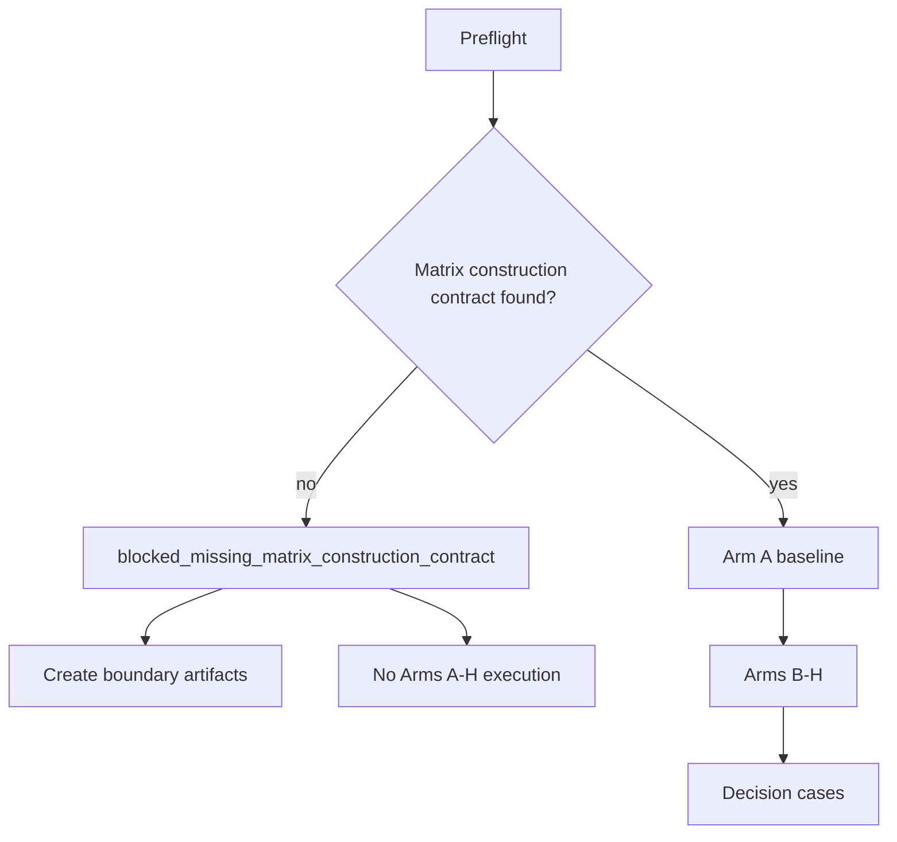

# Lag-Class Sufficiency Execution Flowchart

```mermaid
flowchart TD
  A[Preflight] --> B{Matrix construction contract found?}
  B -- no --> C[blocked_missing_matrix_construction_contract]
  C --> D[Create boundary artifacts]
  C --> E[No Arms A-H execution]
  B -- yes --> F[Arm A baseline]
  F --> G[Arms B-H]
  G --> H[Decision cases]
```

This run followed the blocked branch.
