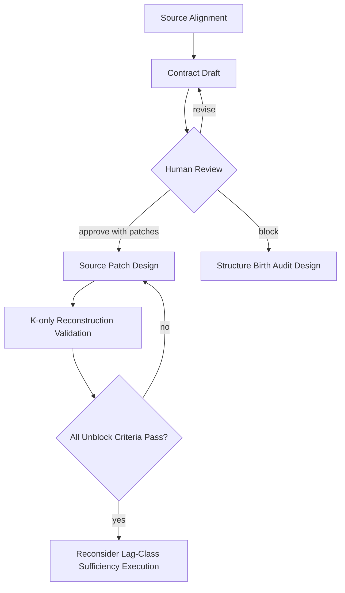

# Matrix Construction Contract Flow

```mermaid
flowchart TD
  A[Source Alignment] --> B[Contract Draft]
  B --> C{Human Review}
  C -->|approve with patches| D[Source Patch Design]
  C -->|revise| B
  C -->|block| E[Structure Birth Audit Design]
  D --> F[K-only Reconstruction Validation]
  F --> G{All Unblock Criteria Pass?}
  G -->|yes| H[Reconsider Lag-Class Sufficiency Execution]
  G -->|no| D
```

