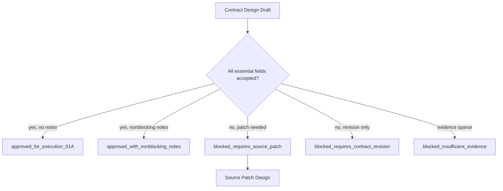

# Human Review Decision Tree

```mermaid
flowchart TD
  A[Contract Design Draft] --> B{All essential fields accepted?}
  B -->|yes, no notes| C[approved_for_execution_01A]
  B -->|yes, nonblocking notes| D[approved_with_nonblocking_notes]
  B -->|no, patch needed| E[blocked_requires_source_patch]
  B -->|no, revision only| F[blocked_requires_contract_revision]
  B -->|evidence sparse| G[blocked_insufficient_evidence]
  E --> H[Source Patch Design]
```

