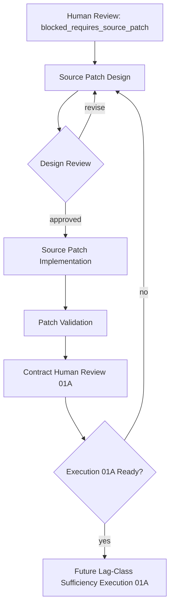

# Source Patch Design Flow

```mermaid
flowchart TD
  A[Human Review: blocked_requires_source_patch] --> B[Source Patch Design]
  B --> C{Design Review}
  C -->|approved| D[Source Patch Implementation]
  C -->|revise| B
  D --> E[Patch Validation]
  E --> F[Contract Human Review 01A]
  F --> G{Execution 01A Ready?}
  G -->|yes| H[Future Lag-Class Sufficiency Execution 01A]
  G -->|no| B
```

