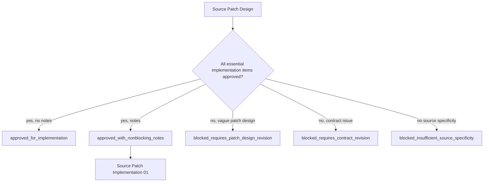

# Source Patch Design Review Decision Tree

```mermaid
flowchart TD
  A[Source Patch Design] --> B{All essential implementation items approved?}
  B -->|yes, no notes| C[approved_for_implementation]
  B -->|yes, notes| D[approved_with_nonblocking_notes]
  B -->|no, vague patch design| E[blocked_requires_patch_design_revision]
  B -->|no, contract issue| F[blocked_requires_contract_revision]
  B -->|no source specificity| G[blocked_insufficient_source_specificity]
  D --> H[Source Patch Implementation 01]
```

