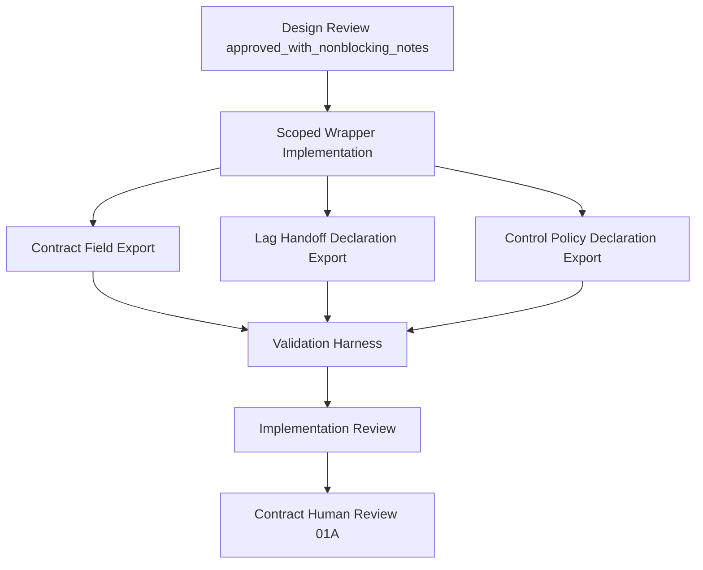

# Source Patch Implementation Flow

```mermaid
flowchart TD
  A[Design Review approved_with_nonblocking_notes] --> B[Scoped Wrapper Implementation]
  B --> C[Contract Field Export]
  B --> D[Lag Handoff Declaration Export]
  B --> E[Control Policy Declaration Export]
  C --> F[Validation Harness]
  D --> F
  E --> F
  F --> G[Implementation Review]
  G --> H[Contract Human Review 01A]
```
